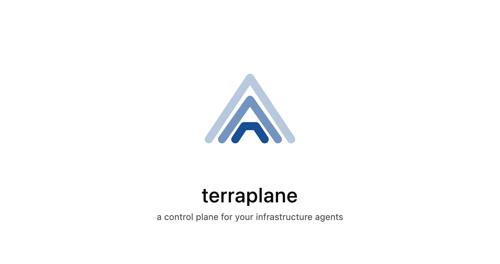

<p align="center">
  
</p>

<p align="center">
  PR-driven Terraform automation with remote agents.
</p>

---

# Still baking
This repository is so WIP it hurts. Nothing in here is designed for public consumption, nor should it be relied on for anything other than interest. It's a project I've wanted to make for a long but I've yet to determine if I have the capacity to see it through.

## Why Terraplane?

Terraform changes should be reviewable, repeatable, and tied to pull requests — not tribal knowledge or ad-hoc laptop runs. Tools like Atlantis proved that model works: comment on a PR, get a plan, apply when ready.

Terraplane keeps that workflow and re-shapes the execution model. Instead of one process that both receives webhooks *and* runs Terraform, Terraplane splits into:

- an **orchestrator** — webhooks, job state, PR feedback (can live on the public internet)
- **agents** — long-lived workers that connect *out* over WebSocket and run Terraform where credentials and network access actually live

That split is the point. A lot of real infrastructure isn’t reachable from outside your environment — private APIs, internal control planes, VPC-only endpoints, on-prem systems. With a single remote runner you’d either expose those targets (firewall holes, peering, public load balancers) or give up on automating them. Agents sit *inside* the network that can already reach those resources; the orchestrator never needs a path in.

Stacks declare which agent should handle them. Multi-account / multi-environment setups become a routing problem, not “stuff every credential into one box” or “punch a hole so the control plane can see the private thing.”

## Acknowledgements

**Terraplane would not exist without [Atlantis](https://www.runatlantis.io/).**

Atlantis set the standard for PR-based Terraform: comment-driven plans and applies, locking, and feedback on the PR itself. Terraplane borrows heavily from that UX and mental model. If you’ve used Atlantis, the commands will feel familiar on purpose.

Where Terraplane diverges is architecture — remote agents and stack→agent routing — not the idea that Terraform belongs in the pull request.

## How it works

```
GitHub PR comment
       │
       ▼
┌──────────────┐     WebSocket      ┌─────────────────┐
│ Orchestrator │ ◄────────────────► │ Agent(s)        │
│ webhooks,    │                    │ clone, plan,    │
│ jobs, locks, │                    │ apply           │
│ PR comments  │                    └─────────────────┘
└──────────────┘
```

1. A PR comment like `terraplane plan -s stg-apse2-foundation` hits the orchestrator.
2. The orchestrator reads `terraplane.yaml` from the repo, resolves stacks, and dispatches work to the named agent.
3. The agent runs Terraform and streams results back.
4. The orchestrator posts plan/apply/unlock feedback on the PR.

### Repo config

Each Terraform repo ships a `terraplane.yaml`:

```yaml
stacks:
  - name: stg-apse2-foundation
    agent: agent-dev
    dir: terraform/environments/staging/ap-southeast-2/foundation
```

### Commands

| Comment | Effect |
|---------|--------|
| `terraplane plan` | Plan all stacks (or `-s <name>`) |
| `terraplane apply` | Apply resolved stacks |
| `terraplane unlock` | Clear locks/jobs for stacks |

## Local development

```bash
# Prerequisites: Go (see go.mod), Docker, a GitHub deploy key for agents

cp .env-example .env   # fill in GitHub secrets, agent key path, etc.
docker compose up --build
```

Compose brings up Postgres, runs migrations, starts the orchestrator on `:8080`, and boots agent containers.

Useful Make targets:

| Target | Description |
|--------|-------------|
| `make build` | Build `./bin/terraplane` |
| `make unit-test` | Vet + unit tests |
| `make generate` | `go generate` (mocks, etc.) |
| `make run-orchestrator` / `make run-agent` | Run binaries locally |

## Configuration

Config is environment variables (optional `.env` via Viper). Highlights:

| Variable | Role |
|----------|------|
| `ORCHESTRATOR_GITHUB_WEBHOOK_SECRET` | GitHub webhook HMAC |
| `ORCHESTRATOR_GITHUB_ACCESS_TOKEN` | GitHub API (files, comments) |
| `DATABASE_URL` / `DATABASE_DRIVER` | Job/lock persistence |
| `SHARED_AUTH_TOKEN` | Orchestrator ↔ agent auth |
| `AGENT_ID` | Must match `agent:` in `terraplane.yaml` |
| `AGENT_ORCHESTRATOR_URL` | WebSocket URL (`ws://…/ws`) |
| `AGENT_SCM_SSH_KEY_PATH` | Deploy key for clone |

## Deployment

**Coming soon.** There are no Helm charts or production install guides yet. Today the supported path is Docker Compose for local/dev. Packaged deployment (Helm/Kustomize, example manifests, hardening notes) will land here.

## Status

Early / under active development. APIs, config shape, and agent protocol may change.

## License

TBD
